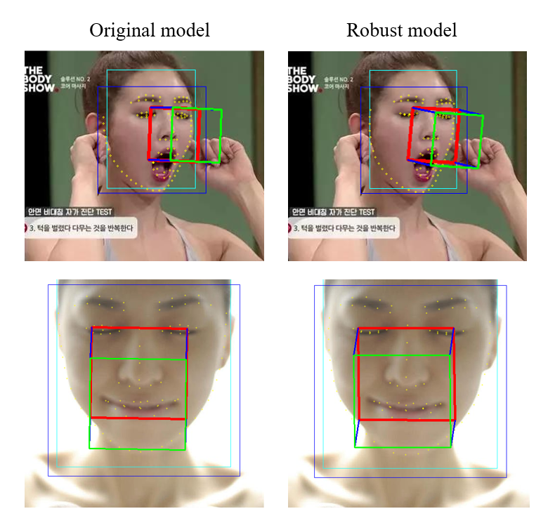
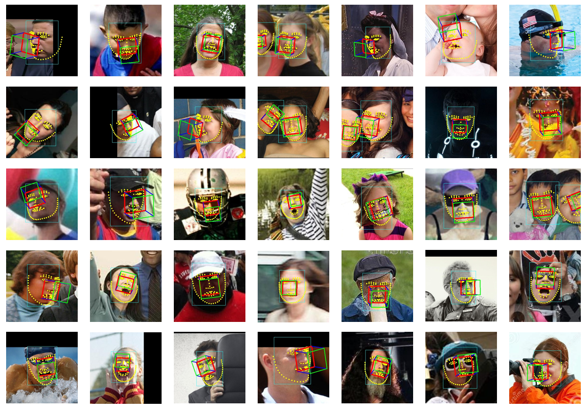
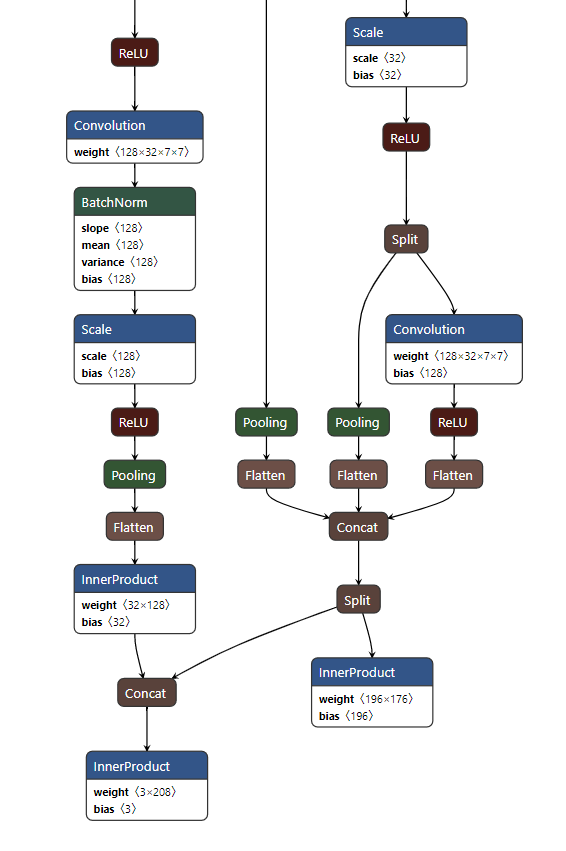
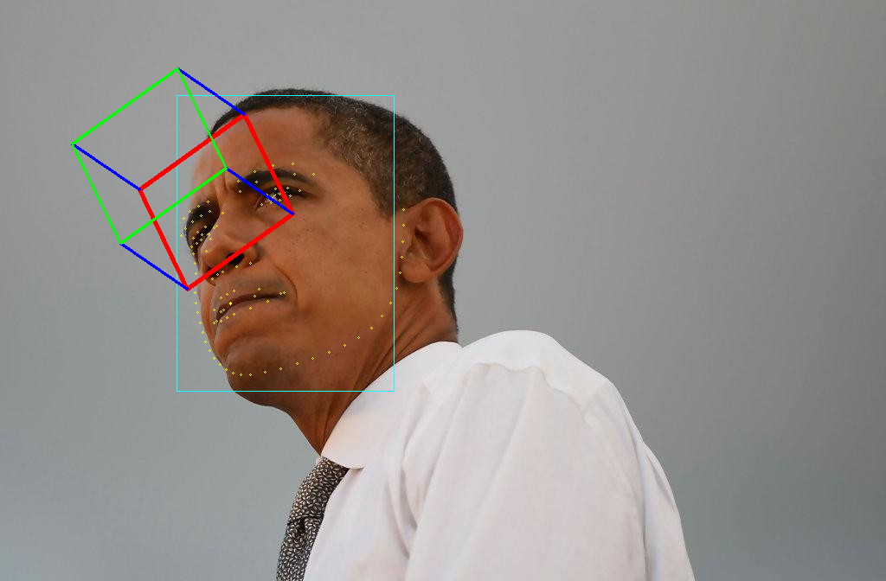
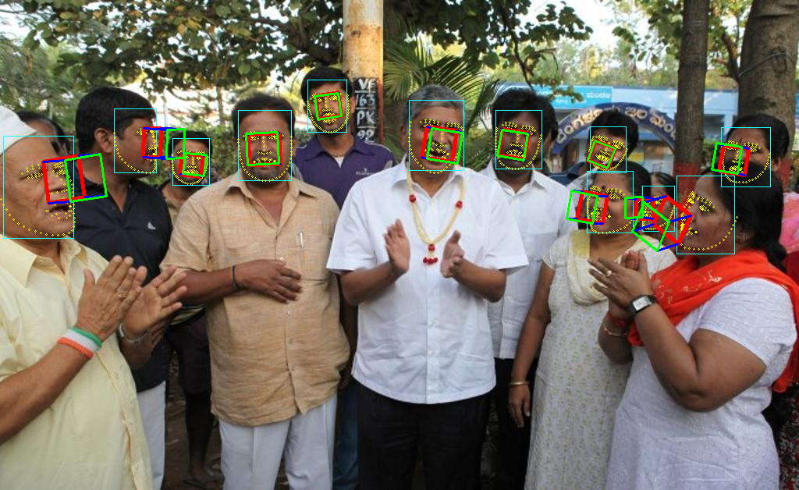
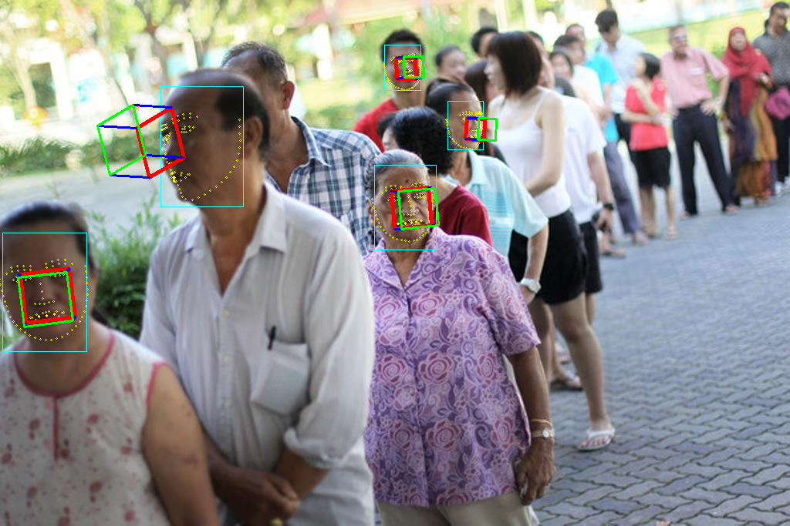
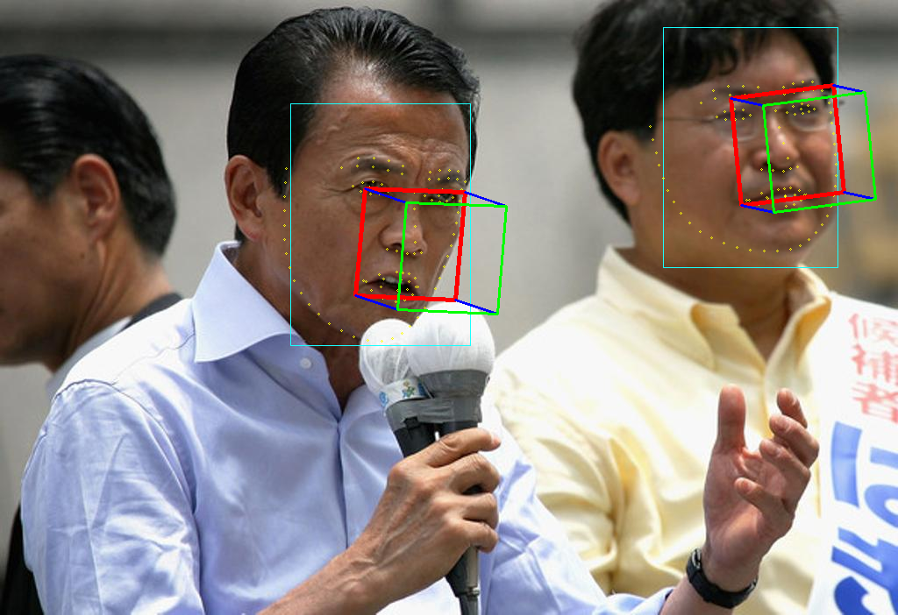

# Improved-PFLD  
PFPLD : A Practical Facial Pose and Landmark Detector.  

**4.9 在master主分支中解决了闭眼情况下关键点不准的问题，以及pose在抬头时候不精确的问题，因为融合了3个数据集
（WLFW+LAPA+300WLP，后面补充的LAPA主要用于解决闭眼问题，300WLP主要用于解决pose问题），因此新的代码对
dataloader以及wing loss函数进行了优化，目前已经整理好放出来了！请使用PFPLD-Dataset数据集进行训练！欢迎尝鲜！**

**PS：如果想按原来的WFLW-POSE数据进行训练，请切换分支到V1.1.1**  


优化了wing loss，融合了68点以及pose更加精准的300WLP数据集、LAPA106数据集中闭眼数据、原有WFLW数据集。
进行multi-task的训练，最后有效提升了闭眼情况下关键点不准题，以及pose在抬头时候不精确的问题


- 用PRNet标注人脸图像的角度数据，这比原始通过solvePNP得到效果好很多,增强了模型对pose的支持
- pfld loss收敛速度比较慢，因此对多种loss进行了对比，使用wing loss的效果更加明显。
- 改进了pfld网络结构，让关键点和姿态角度都能回归的比较好，将关键点分之任务合并到pose分之中，
这样做的好处是让其相互影响，两个任务毕竟相关性较强。  


#### install requirements

~~~shell
- cuda
- pytorch==0.4.1+
- onnx
- onnx-simplifier
- onnxruntime
- torchvision
- opencv-python
~~~

#### Datasets
##### For original model  
WFLW-POSE([BaiduNetdist](https://pan.baidu.com/s/1DYxfhDtWCe1aBixUzVUyEQ) 
code：mcvt)  
##### For robust model  
PFPLD-Dataset([BaiduNetdist](https://pan.baidu.com/s/1QgWplwxfkySMs5LqXNXkwQ) 
code：u7ty)  

#### training & testing

training :

~~~shell
$ sh train_wing.sh
~~~

testing:

~~~shell
$ python test.py
~~~

#### Convert
1. Generate onnx file
```Shell
python convert_to_onnx.py

python3 -m onnxsim ./models/onnx/checkpoint_epoch_final.onnx ./models/onnx/pfpld.onnx

```

#### Example
  






#### Reference: 

paper: [A Practical Facial Landmark Detector](https://arxiv.org/pdf/1902.10859.pdf)   
code: [Tensorflow Implementation](https://github.com/guoqiangqi/PFLD)  
code: [Pytorch Implementation](https://github.com/polarisZhao/PFLD-pytorch)   
#### TODO:
- [x] training code
- [x] caffe inference
- [x] ncnn inference
- [x] nnie inference
