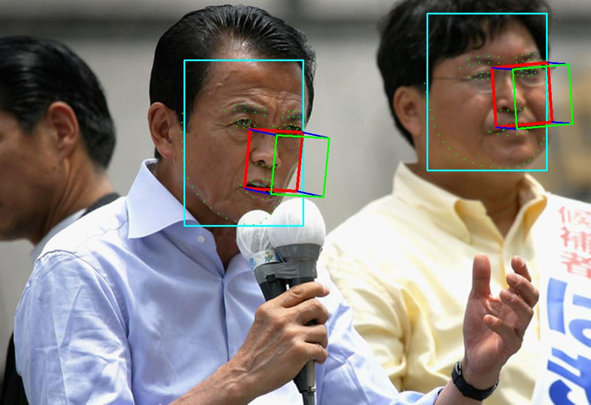

### Dependencies
* [ncnn](https://github.com/Tencent/ncnn)
* [RetinaFace-Cpp](https://github.com/hanson-young/RetinaFace-Cpp/tree/master/Demo/ncnn)
* opencv

### Convert
Onnx file change to ncnn(*.id.h, *.ncnnmodel)
```Shell
cd .../ncnn/build/tools/onnx
./onnx2ncnn pfpld.onnx pfpld.param pfpld.bin
cd ..
cp onnx/pfpld.bin ./pfpld.bin
cp onnx/pfpld.param ./pfpld.param
./ncnn2mem pfpld.param pfpld.bin pfpld.id.h pfpld.mem.h
cat pfpld.param.bin pfpld.bin > pfpld.ncnnmodel
```
### Run
```Shell
mkdir build  
cd build
cmake ..
make -j4
./pfpld_ncnn 
```

### Example


